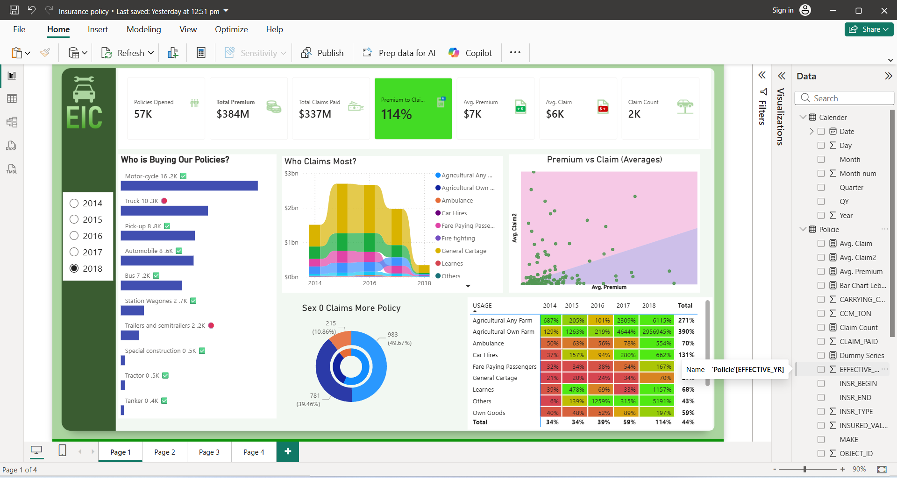

# 🛡️ EIC Insurance Policy Analysis Dashboard (Power BI)

A comprehensive financial insurance risk and management dashboard tracking global policies, premiums, and historic claim distributions.

## 🚀 Key Performance Indicators (KPIs)
* **Total Policies Opened:** 57K
* **Total Premium Collected:** $384M
* **Total Claims Paid:** $337M
* **Premium-to-Claim Ratio:** 114%

## 🔍 Core Visual Insights
* **Product Density:** Volume analysis showcasing Motorcycle (16.2K) and Truck (10.3K) policy dominance.
* **Loss Ratios:** Premium vs Claim area graphs mapped historically from 2014 to 2018 to pinpoint structural risks.
* **Portfolio Mix:** Tabular usage metrics analyzing claims across commercial and domestic policies.

## 🛠️ Tech Stack & Methodology
* **BI Tool:** Power BI Desktop
* **Architecture:** Chandoo Financial Analysis Framework.
* **Analytics Engine:** Advanced DAX for dynamic claim counts and loss ratio reporting.

---

## 📷 Dashboard Screenshot

## 🎥 Interactive Workflow (Silent Walkthrough)

